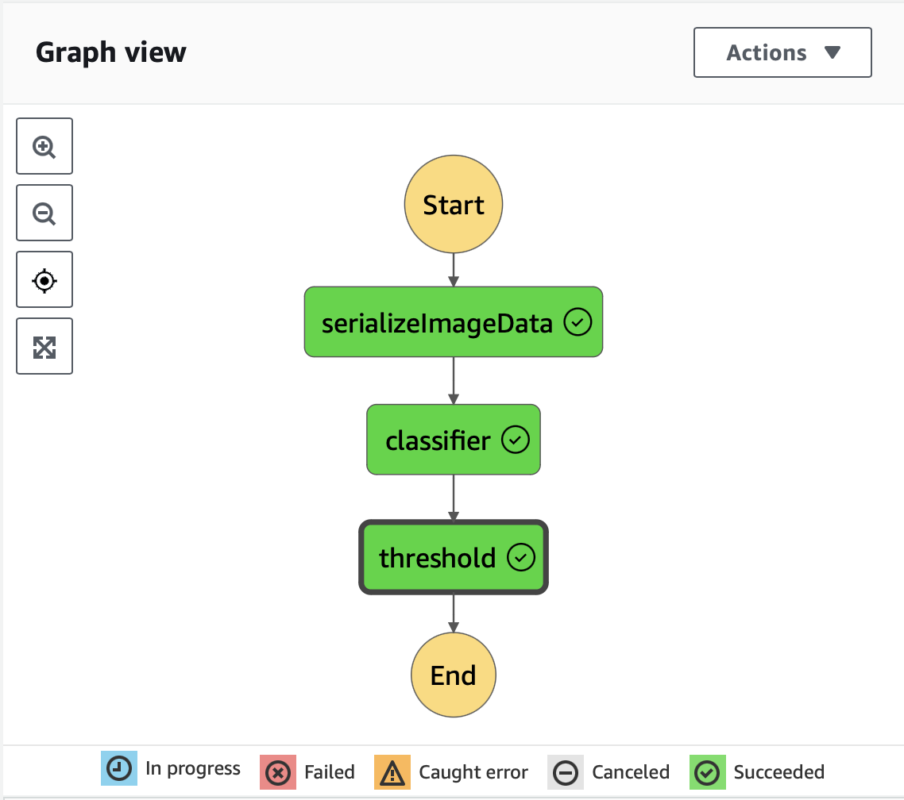
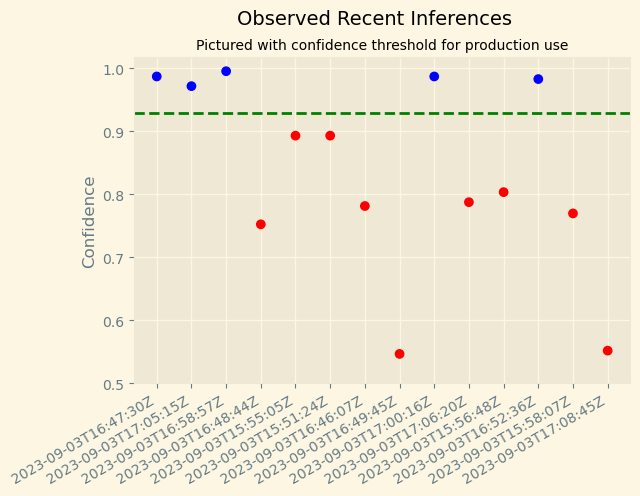

# Scones Unlimited Vehicle Classifier

## Introduction
Imagine being part of a dynamic team at Scones Unlimited, a logistics company specializing in scone deliveries. As a Machine Learning Engineer (MLE), you have the task of developing an Image Classification model that can optimize the way the company operates.

The primary focus of this project is building an image classification model that can automatically detect which kind of vehicle delivery drivers have, in order to route them to the correct loading bay and orders. Assigning delivery professionals who have a bicycle to nearby orders and giving motorcyclists orders that are farther can help Scones Unlimited optimize their operations.

In this project, we use AWS Sagemaker to build an image classification model that can tell bicycles apart from motorcycles. We deploy the model, use AWS Lambda functions to build supporting services, and AWS Step Functions to compose our model and services into an event-driven application.

## Project Steps Overview
* Step 1: Data staging
* Step 2: Model training and deployment
* Step 3: Lambdas and step function workflow
* Step 4: Testing and evaluation

## State Machine

## Inferences Sample

